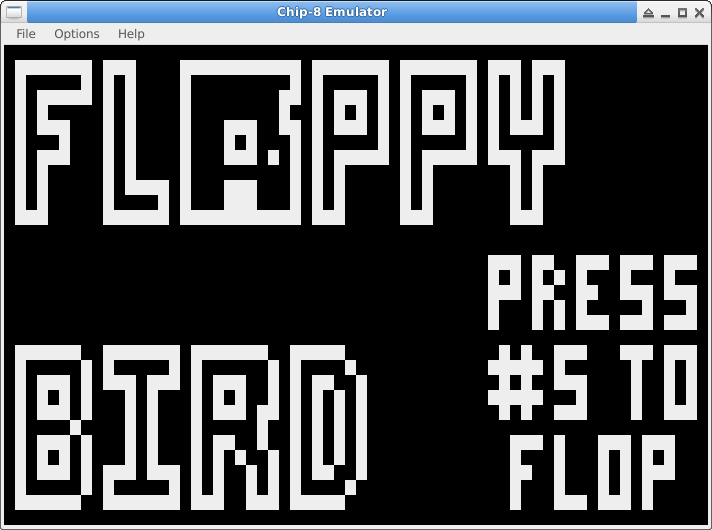
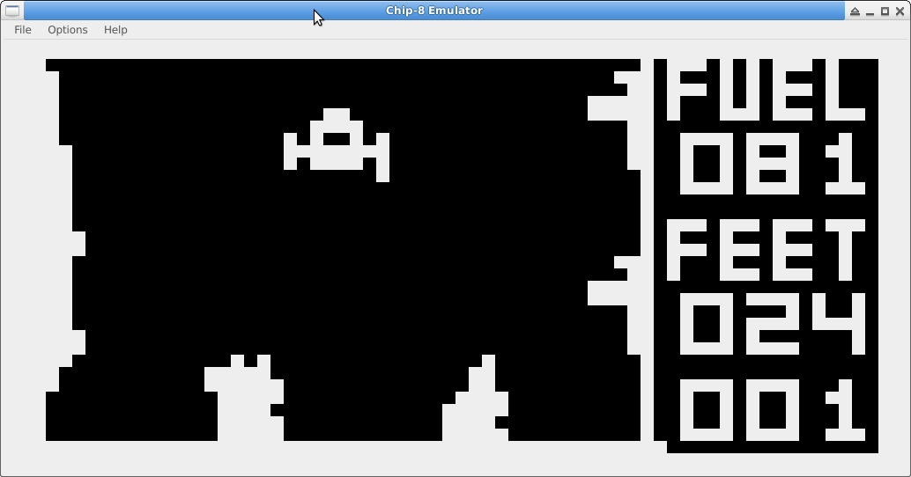
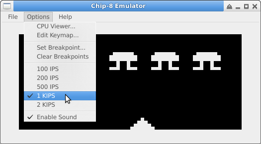
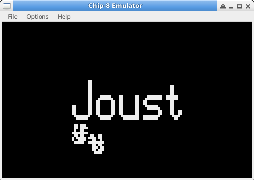
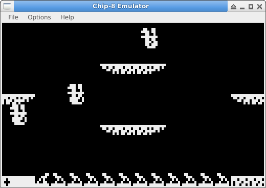
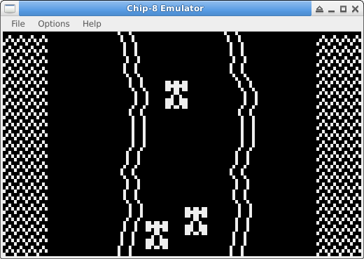
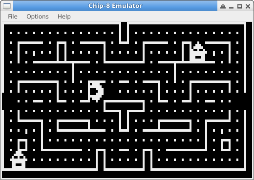

# chip8

Chip8 Emulation and Disassembler

Note to audience:  This will be an exploration process (not reading a guide on how its recommended to do something, but just blast forward on my own path of discovery, which could end in spectacular, but educational, failure.)

# Tools

Haroopad for notes / documentation

C and C\+\+ for the underlying code.  I usually Qt-ify my personal projects because I like Qt, but I fear my C/C++ core skills may have rusted a bit in the process

Qt for graphical interface

# Build instructions

I have tested regularly on my Ubuntu 14.04 64-bit development platform.  I have occasionally tested on Windows XP and Windows 10 Tech Preview running in VMs.

## Disassembler

This should be normal portable C++.  I have a compilation script in the src directory to compile it.

    ./c.sh

## Emulator

The emulator should only depend on Qt and libao (cross platform audio library).  I'm using Qt 4.8.6 that I'm 75% sure is in the Ubuntu package repo.  I wanted to do more as standard C\+\+, but I needed a threading library, so Qt picks up that responsibility rather than pthread or C\+\+ 11 support.

I also briefly tested with Qt 5.3.

Not sure exactly what packages Qt is in, I suspect it is either libqt4-dev or qt5-defaults.  The audio library was libao-dev package.

To compile the Qt application, cd with your terminal to src directory.

    mkdir build
    cd build
    qmake ../chip8emu.pro
    make

Alternatively, if one would like to compile without the sound / libao dependency, execute the following:

    mkdir build
    cd build
    qmake CONFIG+=NO_SOUND ../chip8emu.pro
    make

## My Custom ROM - Floppy Bird

Inspired by the mobile hit game Flappy Bird, I created a Chip-8 version.  It was written in assembly, and then compiled into the ROM format using the CHIPPER assembler.

## Screenshots

### Lunar Lander

### Space Invaders

## Screenshots - Super Chip-8 Graphical Mode

### Joust - Works great!

### Car - Works great!

### Blinky Hi-Res - Has issues...

The bad ghosts sprite doesn't always disasppear and other weird stuff.  Still investigating.

### Cpu Viewer / ROM Debugging Options

Can any number of breakpoints in the emulator to halt the emulator on.  CPU Viewer windows allows the user to inspect all the registers and the call stack.  User can then single step, reset, or continue running the ROM.

# Disassembler

I want to take a few approaches with this.

I want to start making a disassembler that just ingests the whole ROM and interprets every 2 bytes as op-code information.  I realize this is wrong because I've noticed some of the ROMs have binary data in the ROM that isn't executable code.

If code will ever jump to an odd-address (addr % 2 == 1), it will produce garbage during linear disassemble.

I then want to expand on that to develop a recursive disassembler (I've read that is how IDA Pro and radare are).  This seems like it would be straightforward for hardcoded jump instruction like 1NNN and 2NNN, but will be problematic for BNNN which uses V0 as an offset for the jump.

If I'm fealing really crafty and over-achieving:

* Let the user add addresses to the chunks of binary that will be interpreted as instructions (so the user can analyze a BNNN instruction and manually provide the destination)
* Create a table of all the locations jumped from and too, then comment the disassembly with that info

Update:  Haven't seen many BNNN instructions.  Do see lots of sprites, added a binary sprite viewer to the disassembler so the sprites can easily be picked out and viewed.

### Disassembler usage

####Linear disassemble (not recommended)

    ./chip8da -l ~/working/chip8/cots/roms/c/hidden.rom

The hidden.rom is great example because it has lots of graphics and opcodes starting on odd numbers.  Completely useless to analyze in this manner.

This will interpret all bytes as opcodes, which shows stuff like the following:

    0x0200  jmp 0x021d
    0x0202  skipnext_ne v8, 0x49
    0x0204  skipnext_ne v4, 0x44
    0x0206  skipnext_ne v5, 0x4e
    0x0208  call 0x0120
    0x020a  skipnext_eq v1, 0x2e
    0x020c  skipnext_eq v0, 0x20
    0x020e  skipnext_ne v2, 0x79
    0x0210  call 0x0044
    0x0212  mov v1, 0x76
    0x0214  mov v9, 0x64
    0x0216  call 0x0057
    0x0218  skipnext_ne v9, 0x4e
    0x021a  BAD OPCODE 0x5445
    0x021c  BAD OPCODE 0x52a4
    ...
    0x052a  skipnext_ne v0, 0x40
    0x052c  skipnext_ne v0, 0x3c
    0x052e  BAD OPCODE 0x007c
    0x0530  jmp 0x0010
    0x0532  jmp 0x007c
    0x0534  BAD OPCODE 0x00ff
    0x0536  BAD OPCODE 0x0000
    0x0538  mov v0, v0
    0x053a  mov v0, v0
    0x053c  BAD OPCODE 0x0000
    0x053e  mov v0, v0
    0x0540  mov v0, v0
    0x0542  BAD OPCODE 0x00ff

== Instructions updated to more closely reflect what the CHIPPER assembler uses ==

#### Recursive disassemble (way better)

	./chip8da -r ~/working/chip8/cots/roms/c/hidden.rom

Those same sections of code now disassemble as follows:

    0x0200  jmp 0x021d                                      ; == BEGINNING OF CODE BLOCK ==
    0x0202  DATA = 0x48     GRAPHIC =  #  #         ASCII(H)
    0x0203  DATA = 0x49     GRAPHIC =  #  #  #      ASCII(I)
    0x0204  DATA = 0x44     GRAPHIC =  #   #        ASCII(D)
    0x0205  DATA = 0x44     GRAPHIC =  #   #        ASCII(D)
    0x0206  DATA = 0x45     GRAPHIC =  #   # #      ASCII(E)
    0x0207  DATA = 0x4e     GRAPHIC =  #  ###       ASCII(N)
    0x0208  DATA = 0x21     GRAPHIC =   #    #      ASCII(!)
    0x0209  DATA = 0x20     GRAPHIC =   #     
    ...
    0x0519  DATA = 0xff     GRAPHIC = ########
    0x051a  DATA = 0x80     GRAPHIC = #       
    0x051b  DATA = 0x8f     GRAPHIC = #   ####
    0x051c  DATA = 0x90     GRAPHIC = #  #    
    0x051d  DATA = 0x8e     GRAPHIC = #   ### 
    0x051e  DATA = 0x81     GRAPHIC = #      #
    0x051f  DATA = 0x9e     GRAPHIC = #  #### 
    0x0520  DATA = 0x80     GRAPHIC = #       
    0x0521  DATA = 0x91     GRAPHIC = #  #   #
    0x0522  DATA = 0x91     GRAPHIC = #  #   #
    0x0523  DATA = 0x9f     GRAPHIC = #  #####
    0x0524  DATA = 0x91     GRAPHIC = #  #   #
    0x0525  DATA = 0x91     GRAPHIC = #  #   #
    0x0526  DATA = 0x80     GRAPHIC = #       
    0x0527  DATA = 0xff     GRAPHIC = ########
    0x0528  DATA = 0x00     GRAPHIC =         
    0x0529  DATA = 0x3c     GRAPHIC =   ####        ASCII(<)
    0x052a  DATA = 0x40     GRAPHIC =  #            ASCII(@)
    0x052b  DATA = 0x40     GRAPHIC =  #            ASCII(@)
    0x052c  DATA = 0x40     GRAPHIC =  #            ASCII(@)
    0x052d  DATA = 0x3c     GRAPHIC =   ####        ASCII(<)
    0x052e  DATA = 0x00     GRAPHIC =         
    0x052f  DATA = 0x7c     GRAPHIC =  #####        ASCII(|)
    0x0530  DATA = 0x10     GRAPHIC =    #    
    0x0531  DATA = 0x10     GRAPHIC =    #    
    0x0532  DATA = 0x10     GRAPHIC =    #    
    0x0533  DATA = 0x7c     GRAPHIC =  #####        ASCII(|)
    0x0534  DATA = 0x00     GRAPHIC =         
    0x0535  DATA = 0xff     GRAPHIC = ########

We can now plainly see the ASCII text at the beginning of the ROM, and the graphics later in the ROM.  There were no bad op-codes found when disassembling this way.

Use the -h flag on disassembly to hide the address field.  This creates an output that can assembled with CHIPPER.

	./chip8da -r -h ../customRom/floppybird.rom

Output:

    ; Setting used by the chipper assembler
    option schip11
    option binary
    align off

    ; Recursive Disassembly
    End of file
    loc_0200:   ; == START OF CODE BLOCK ==
    call loc_02b2
    ld va, #00
    ld vd, #06
    ld ve, #06
    ld v9, #00
    call loc_028c
    loc_020c:   ; == START OF CODE BLOCK ==
    cls
    call loc_0228
    call loc_0296
    call loc_027e
    ld vf, #00
    call loc_0264
    se vf, #00
    jp loc_0334
    ld v1, #0a

## Op-Code Patterns

Exact match op-codes

* 00E0: clear screen
* 00EE: return from subroutine

Jump Instructions (provides 12-bit address)

* 1NNN: jump to address
* 2NNN: call address

Address Instructions (provides 12-bit address)

* ANNN: I = NNN
* BNNN: Jump to NNN + V0

Operates on register with 8-bit constant

* 3XNN: Skip next instruction if VX == NN
* 4XNN: Skip next instruction if VX != NN
* 6XNN: VX = NN
* 7XNN: VX += NN
* CXNN: VX = rand() & NN

Operations involving 2 registers
* 5XY0: Skip next instruction if VX == VY
* 9XY0: Skip next instruction if VX != VY
* 8XY0: VX = VY
* 8XY1: VX = VX | VY
* 8XY2: VX = VX & VY
* 8XY3: VX = VX xor VY
* 8XY4: VX += VY (VF set to 1 on carry)
* 8XY5: VX = VX - VY (VF set to 0 on borrow)
* 8XY7: VX = VY - VX (VF set to 0 on borrow)

Operations involving only 1 general purpose register:

* 8X06: VX = VX >> 1 (VF set to bit shifted out) - Discrepency between wikipedia and other sites on this opcode
* 8X0E: VX = VX << 1 (VF set to bit shifted out) - Discrepency between wikipedia and other sites on this opcode
* EX9E: Skip next instruction if key stored in VX is pressed
* EXA1: Skip next instruction if key stored in VX is not pressed
* FX0A: Wait for key press, store in VX
* FX07: VX = Delay Timer value
* FX15: Delay Timer = VX
* FX18: Sound Timer = VX
* FX1E: I += VX
* FX29: Sets I to location of character sprite for VX
* FX33: Sets *I - *I+2 to BCD value of VX
* FX55: Stores V0-VX in memory at address I.  I += N + 1
* FX65: Fills V0-VX with memory from address I.  I += N + 1

Draw Sprite Command (2 registers, + 4 bit constant)

* DXYN: Draw sprite on screen at coordinate (VX,VY).  Sprite Height N.  Sprite contents at I.

## New and Modified Op-Codes for Super Chip-8

* DXYN: Draw Sprite.  When N is zero, there is now support for a 16-row sprite to be drawn.  If in High-Res mode, the sprite will also be double width (16 pixels), and will require I to be pointed at 32-bytes of data.  In Low-Res mode, it will support writing a 8x16 pixel sprite.

== My reference emulator I use doesn't support a sprites on the bottom of the screen overflowing to the top of the screen in High-Res mode, and it breaks my minesweeper rom, need to make this configurable. ==

* 00CN: Scroll Down N pixels for High-Res mode, or N/2 pixels for Low-Res mode.  David Winter describes the possibility for a half-pixel shift for the low-res mode if N is odd.  I did not implement because it sounds ridiculous.
* 00FC: Scroll Left 4 pixels for High-Res mode, or 2 pixels for Low-Res mode
* 00FB: Scroll Right 4 pixels for High-Res mode, or 2 pixels for Low-Res mode
* 00FD: Quit.  Stops emulator.
* 00FE: Low-Res Mode (64 x 32 resolution)
* 00FF: High-Res Mode (128 x 64 resolution)
* FX30: Load Hi-Res Font.  I supported characters 0-F, but most emulators only support 0-9.
* Save HP48 Flags.  Did not implement
* Load HP48 Flags.  Did not implement

Super Chip-8 also offers double the screen resolution (128x64) over the standard Chip-8 resolution of 64x32.

## Registers

* V0: General purpose / jump offset 
* V1-VE: General purpose
* VF: General purpose / Carry flag
* I: Index Register (16 bits)
* IP: Instruction Pointer (0 - 0xFFF)
* Stack:  16 registers deep, 16-bits
* Delay Timer
* Sound Timer

# Reference Sites:

* Chip 8 instruction set (including superchip instructions):  http://www.multigesture.net/wp-content/uploads/mirror/goldroad/chip8_instruction_set.shtml

* http://www.emulator101.com/

* http://devernay.free.fr/hacks/chip8/C8TECH10.HTM

* David Winter's Chip-8 Webpage:  http://www.pong-story.com/chip8/
